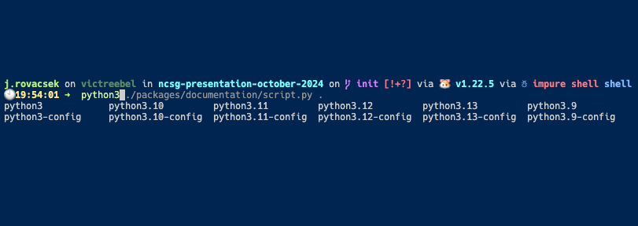
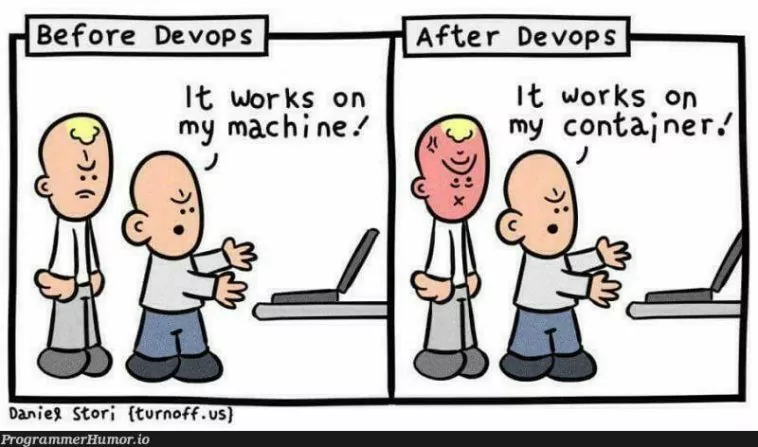

+++
title = "Amnesiac Computing"
outputs = ["Reveal"]
+++



## Amnesiac Computing

---

### $ whoami

Participate in organising NCSG

Threat Management, Technical Assurance Operations and CAPMAN at $work

---



Do feel free to ask questions at any point 🤔

---

### Agenda ⚡️

What Are Amnesiac Systems?

Covering: An introduction to the concept

---

### Agenda ⚡️

Why Use Them?

Covering: Key benefits, risks, and real-world applications

---

### Agenda ⚡️

How to Build and Manage Amnesiac Systems

Covering: An overview of technical challenges and solutions

---



---

### Forward: Windows

May is likely to be possible to do this on Windows, I haven't played in this space

---

## What Is An Amnesiac System?

A system that intentionally does not persist data, either fully or partially

---

## What Is An Amnesiac System?

---

### Approaches to Amnesia

All previous examples were generally amnesic by utilising RAM to store data

---



---

### Alternate Approaches to RAM Exist

- ZFS snapshots
- BTRFS subvolumes

---

~What Are Amnesiac Systems~ ✅

(But do ask questions if you'd like 🙋)

---

Why Use Them?

---

### Amnesiac As A Trait

Far more than just hiding questionable things

---



---

<!--  -->



---



---

---

## How to Build and Manage Amnesiac Systems

---

Let's talk on two deployment types:

- not our machine (business purpose)
- our machine (application of good hygiene)

---

### Not Our Machine

Cattle vs Pets

---

Or, most people enjoy a good hamburger

---

Generally, docker, serverless et al is a safe bet here

State can exist externally

---

Unless you need to host the whole stack...

(Pets at some level)

---

Questions?

---

Thanks!
