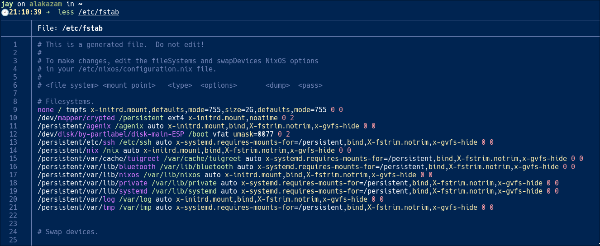
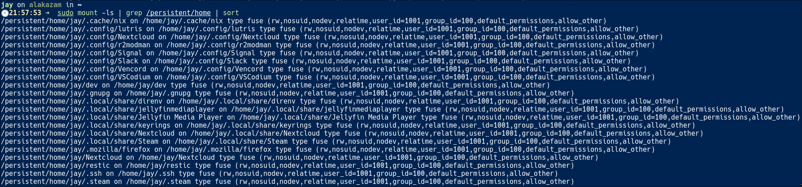

+++
title = "Amnesiac Computing"
outputs = ["Reveal"]
+++



## Amnesiac Computing

---

### $ whoami

Participate in organising NCSG

Threat Management, Technical Assurance Operations and CAPMAN at $work

---



Do feel free to ask questions at any point 🤔

---

### Agenda ⚡️

What Are Amnesiac Systems?

Covering: An introduction to the concept

---

### Agenda ⚡️

Why Use Them?

Covering: Key benefits, risks, and real-world examples

---

### Agenda ⚡️

Building Amnesiac Systems

Covering: An overview of technical challenges and solutions

---



---

### Forward: Windows

It is likely possible to do this on Windows, But I haven't played in this space

---

## What Is An Amnesiac System?

A system that intentionally does not persist data, either fully or partially

---

## What Is An Amnesiac System?

- Tails- OS
- AWS Lambda
- Docker

Any more people might know of? (there's a lot)

---

### Approaches to Amnesia

All previous examples were generally amnesic because they utilise RAM to store data

---



---

### Alternate Approaches to RAM Exist

- ZFS snapshots
- BTRFS subvolumes

But RAM is the simplest approach

---

~What Are Amnesiac Systems~ ✅

(But do ask questions if you'd like 🙋)

---

## Why Use Them?

---

### Amnesiac As A Trait

Far more than just hiding questionable things

---



---




---



---


---

Beyond Repeatability & Reproducibility:

- nerd points (unlimited)
- performance (with limitations)
- security (with limitations)


---

## Risks

Risk of data loss leading to...

---


---

## Real-World Examples

VPN Providers using RAM-only infrastructure ([1](https://mullvad.net/en/blog/we-have-successfully-completed-our-migration-to-ram-only-vpn-infrastructure), [2](https://nordvpn.com/blog/ram-based-servers/), [3](https://surfshark.com/blog/surfshark-upgraded-to-ram-only-servers))

---

## Building Amnesiac Systems

---

Let's talk on two deployment types:

- not our machine (business purpose)
- our machine (application of good hygiene)

---

### Not Our Machine

Cattle 🐮 vs Pets 🐶

---

Or, most people enjoy a good hamburger


---

Generally, docker, serverless, et al is a safe bet here

State can exist externally


---

Unless you need to host the whole stack...

(Pets at some level 🧙)

---

### Self Managed Considerations

- Infrastructure as Code 🧑‍💻️
- Ship logs off devices 🪵
- Automate Refreshes ♻️
- Apply RBAC (limit regression chance) 👮
- Educate admins on design 🧑‍🏫️

---

### tmpfs Root As A Solution

An example of a 2GB tmpfs root mount

```
none / tmpfs x-initrd.mount,defaults,mode=755,size=2G,defaults,mode=755 0 0
```



---

## Our Machine

Less risk of cranky bears

---

### Home Directories

Can be tmpfs'd as well



Otherwise - treat the device as cattle, not a pet

---

Questions?

---

Thanks!
